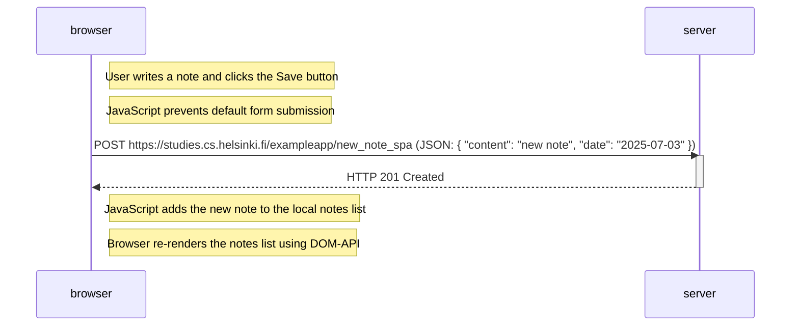

```mermaid
sequenceDiagram
    participant browser
    participant server

    Note right of browser: User writes a note and clicks the Save button
    Note right of browser: JavaScript prevents default form submission
    browser->>server: POST https://studies.cs.helsinki.fi/exampleapp/new_note_spa (JSON: { "content": "new note", "date": "2025-07-03" })
    activate server
    server-->>browser: HTTP 201 Created
    deactivate server

    Note right of browser: JavaScript adds the new note to the local notes list
    Note right of browser: Browser re-renders the notes list using DOM-API
```
